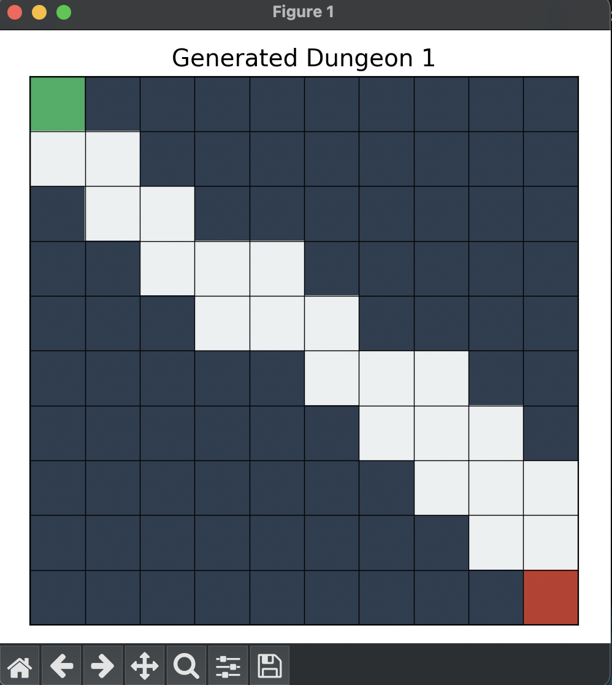
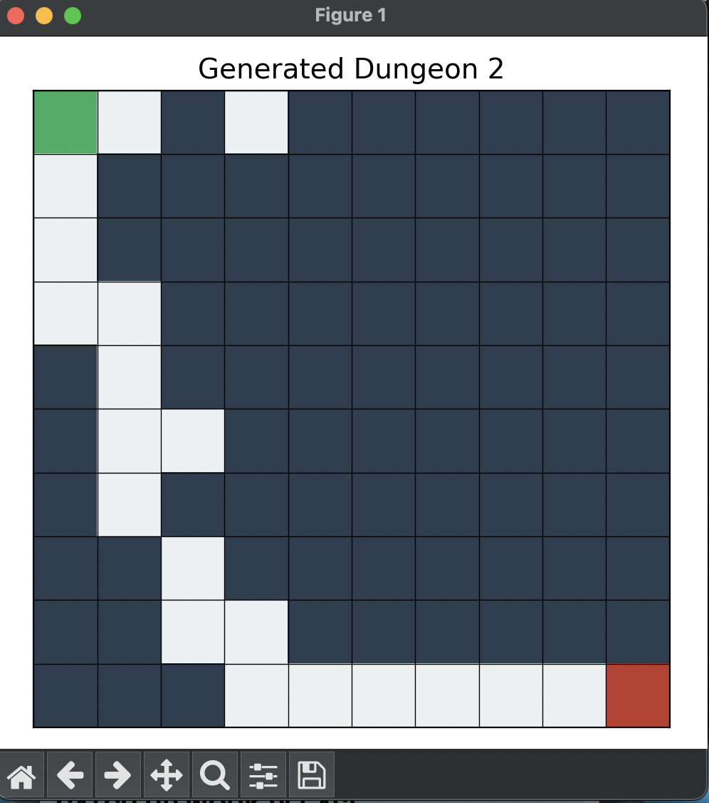
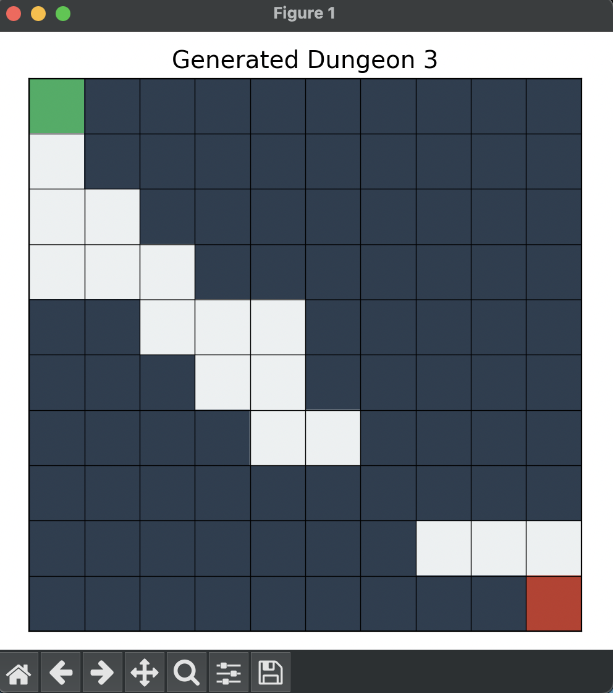
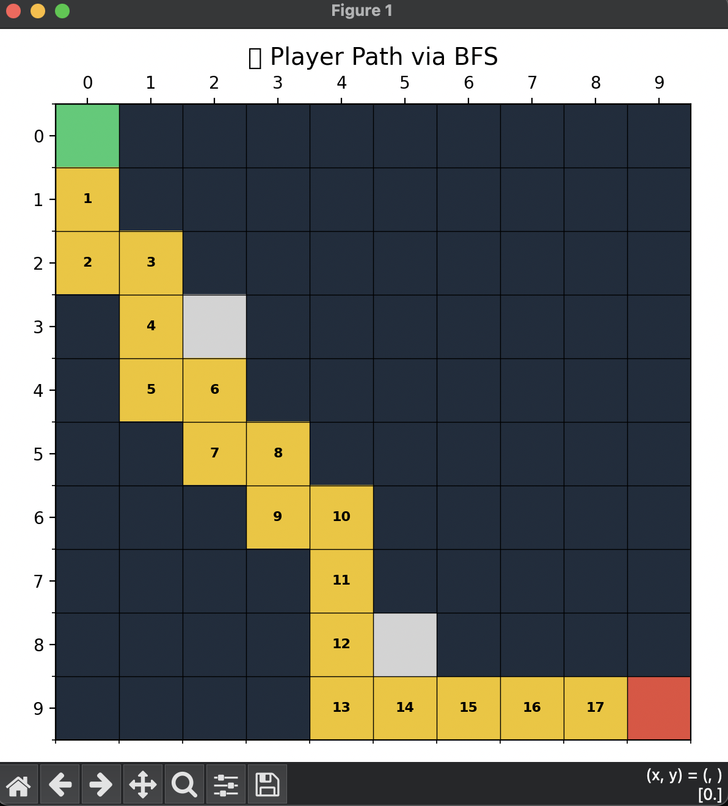

# ML Dungeon Generator | CS4780 Project 

This project combines unsupervised learning and generative modeling to create structured, playable dungeon mazes. Using K-Means clustering and a Variational Autoencoder (VAE), it learns spatial patterns from thousands of randomly generated grids and then samples new layouts from a compressed latent space.

Core Pipeline
-generate_dungeons() creates mazes with guaranteed entry → exit paths.

-KMeans clusters dungeons based on structural similarity.

-VAE learns a low-dimensional latent representation to generate new layouts.

-simulate_player() uses BFS (Breadth-First Search) to check if a generated dungeon is solvable.

-visualize_player_path() overlays the player’s exact solution path (if one exists)

### Generated Mazes

### Generated Player Solutions 
 

# Key Takeaways
-Applies key ML concepts: clustering, latent variables, probabilistic sampling

-Demonstrates generative design for game maps / intelligent systems

-BFS validation ensures outputs are not just realistic—but playable
